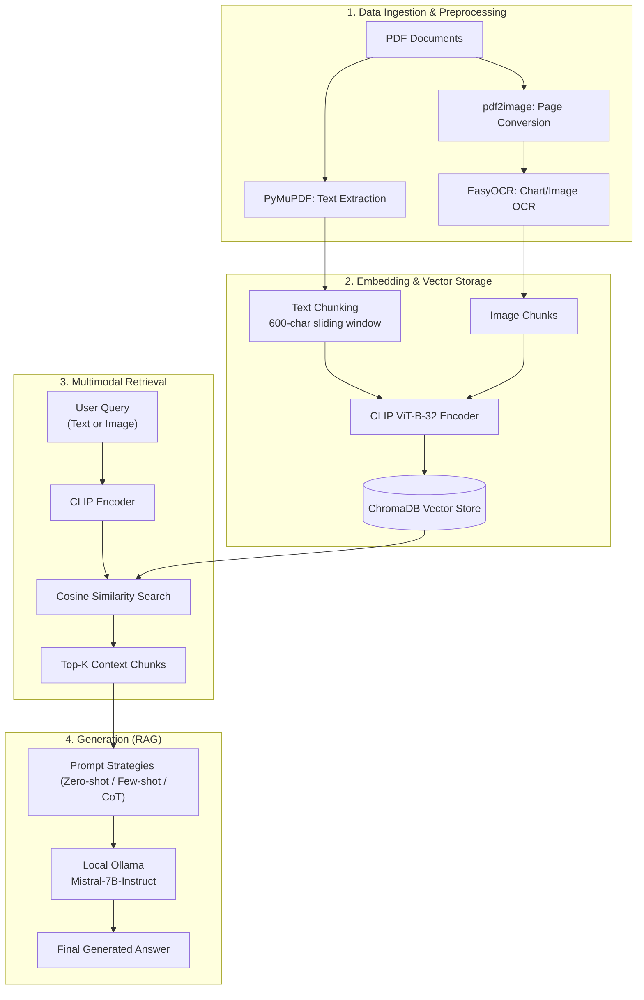

# Multimodal RAG Chatbot (PDFs + Images)

<div align="center">

[](https://www.python.org/)
[](https://streamlit.io/)
[](https://www.trychroma.com/)
[](https://ollama.com/)

</div>

---

### 📋 Assignment Information
- **Course:** AI-4009 Generative AI
- **Posted Date:** Nov 17, 2025
- **Due Date:** Nov 25, 2025
- **Repository:** [https://github.com/i220893/multimodal-rag-chatbot](https://github.com/i220893/multimodal-rag-chatbot)

---

## 🔍 Overview

This project is a **Multimodal Retrieval-Augmented Generation (RAG) Chatbot** designed to answer complex questions based on the content of PDF documents and embedded images. It leverages a local Large Language Model (LLM) via **Ollama** and uses **ChromaDB** for efficient multimodal vector retrieval.

The system supports:
- **Text Retrieval**: Deep search within PDF document content.
- **Visual Search**: Search using query images to find matching visual and textual contexts.
- **Advanced Prompting**: Dynamically configure prompting strategies between **Zero-shot**, **Few-shot**, and **Chain-of-Thought (CoT)**.

---

## 🛠️ System Architecture

The following diagram illustrates the end-to-end data ingestion, embedding storage, retrieval, and generation pipeline:



---

## 📂 Project Structure

```
├── src/
│   ├── chunking/           # Text chunking strategies & sliding windows
│   ├── embeddings/         # CLIP embedding generation logic (text/image)
│   ├── evaluation/         # Retrieval hit rate, latency & generation metrics
│   ├── llm/                # Local LLM integration (Ollama wrapper)
│   ├── pdf_processing/     # PyMuPDF parser, pdf2image & EasyOCR pipelines
│   ├── rag/                # RAG pipeline manager & prompt templates
│   ├── retrieval/          # ChromaDB interaction & similarity search
│   ├── utils/              # General helper utilities
│   ├── vector_store/       # Scripts to build & persist index
│   └── visualizations/     # TSNE & PCA embedding visualization tools
├── chroma_db/              # Local persistent ChromaDB vector store
├── data/                   # Input PDFs / Document directory
├── notebooks/              # Jupyter notebooks for interactive experiments
├── report_plots/           # Evaluation metrics visualization charts
├── streamlit_app.py        # Streamlit web application interface
├── requirements.txt        # Project dependencies list
└── README.md               # Project documentation
```

---

## 🚀 Setup & Installation

### Prerequisites

1. **Python 3.8+** installed.
2. **Ollama** installed and running:
   - Download it from [ollama.com](https://ollama.com/).
   - Pull the default model used by the RAG client:
     ```bash
     ollama pull mistral:7b-instruct-q4_K_M
     ```
     *(Note: You can configure the model string in `src/llm/llm_client.py` if you wish to use a different model).*

### Installation Steps

1. Clone the repository:
   ```bash
   git clone https://github.com/i220893/multimodal-rag-chatbot.git
   cd multimodal-rag-chatbot
   ```

2. Install python dependencies:
   ```bash
   pip install -r requirements.txt
   ```

---

## 💻 Usage

1. **Start the Application**:
   Run the Streamlit server:
   ```bash
   streamlit run streamlit_app.py
   ```

2. **Interact with the Chatbot**:
   - Open the web interface in your browser (typically at `http://localhost:8501`).
   - **Configure Prompting Strategy**: Toggle between **Zero-shot**, **Few-shot**, or **Chain-of-Thought** in the sidebar.
   - **Submit Query**: Type your question in the text box.
   - **Upload Query Image**: (Optional) Upload an image to find visually relevant context.
   - Click **"Run RAG Query"** to trigger retrieval and LLM generation.

---

## 📊 Pipeline & Workflow Detail

### 1. Ingestion & Preprocessing
* **Text Extraction:** Raw text is extracted using `PyMuPDF`.
* **OCR Parsing:** `pdf2image` converts PDF pages into image format, enabling `EasyOCR` to read text embedded in charts, diagrams, and figures.
* **Chunking:** Text chunks are created using a 600-character window with custom sliding boundaries to preserve context across chunks.

### 2. Multi-Modal Embeddings
* Both text chunks and visual page context are embedded into a single shared vector space using the **CLIP (ViT-B-32)** model.
* This mapping enables cross-modal similarity lookups (e.g., retrieving text relevant to a visual cue, or vice versa).

### 3. Similarity Search & Prompting
* ChromaDB acts as the local storage and retrieves the top-K context chunks.
* Staged prompt templates:
  - **Zero-shot**: Directly provides the context and query.
  - **Few-shot**: Includes structured examples of queries and expected answers to guide output.
  - **Chain-of-Thought (CoT)**: Instructs the LLM to think step-by-step and write down reasoning before forming the final response.

---

## 📈 Evaluation & Results

Evaluation scripts (`tests/evaluate_rag_pipeline.py`) measure performance across:
* **Retrieval Hit Rate**: Success rate of matching query to relevant reference page.
* **Text Quality (ROUGE / BLEU)**: Semantic overlap of response against ground truth references.
* **Performance Latency**: Response generation time differences across Zero-shot, Few-shot, and Chain-of-Thought prompting.

Refer to the visual plots stored under [report_plots/](file:///c:/MyProperty/UNI/GenAI/Assignment-3/report_plots) for comprehensive benchmarks.

---

## 📦 Dependencies

Main libraries powering this system:
* `streamlit` — Interactive Web application UI.
* `chromadb` — Embedded vector database.
* `sentence-transformers` — CLIP embedding calculations.
* `easyocr`, `pdf2image`, `pymupdf` — OCR and document ingestion.
* `langchain` — Core pipeline orchestration utility helpers.
