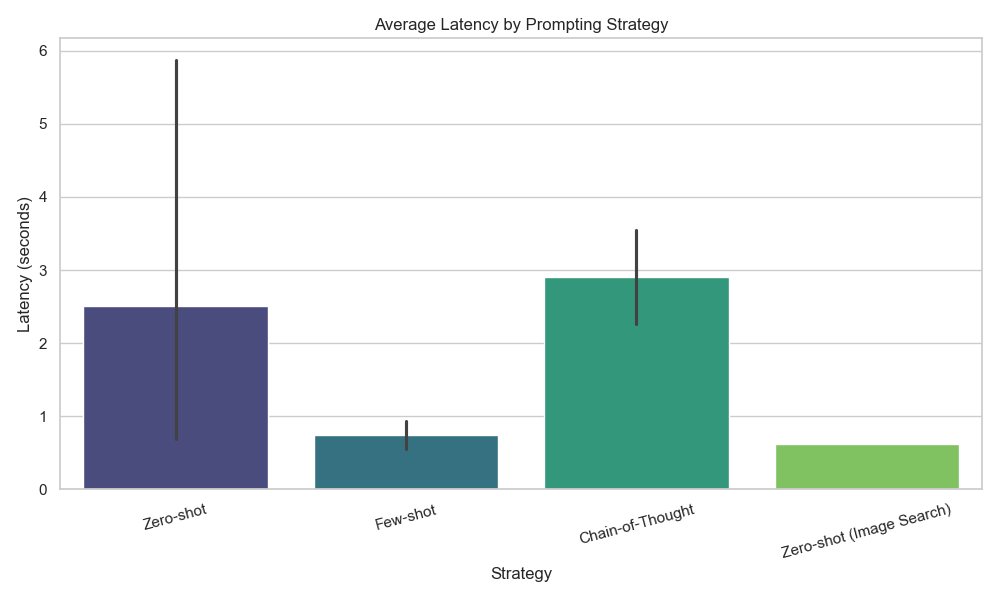
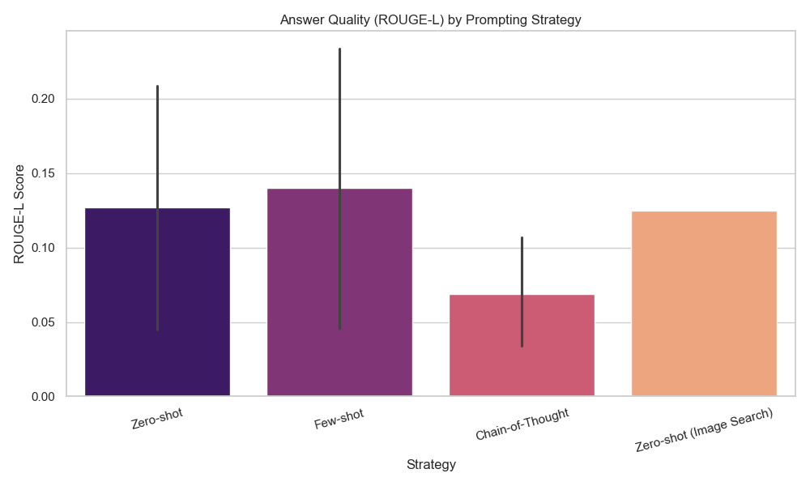
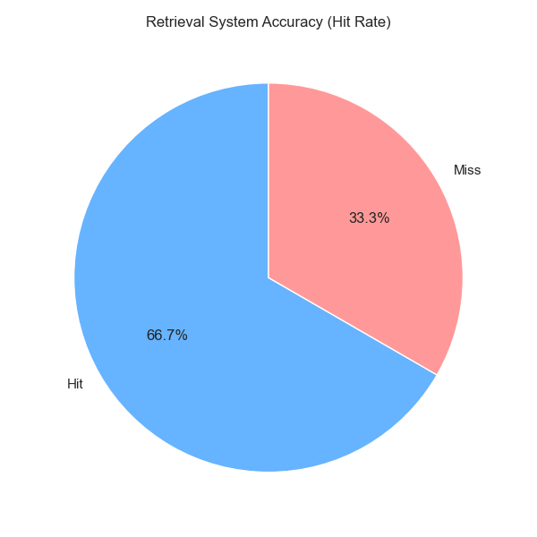
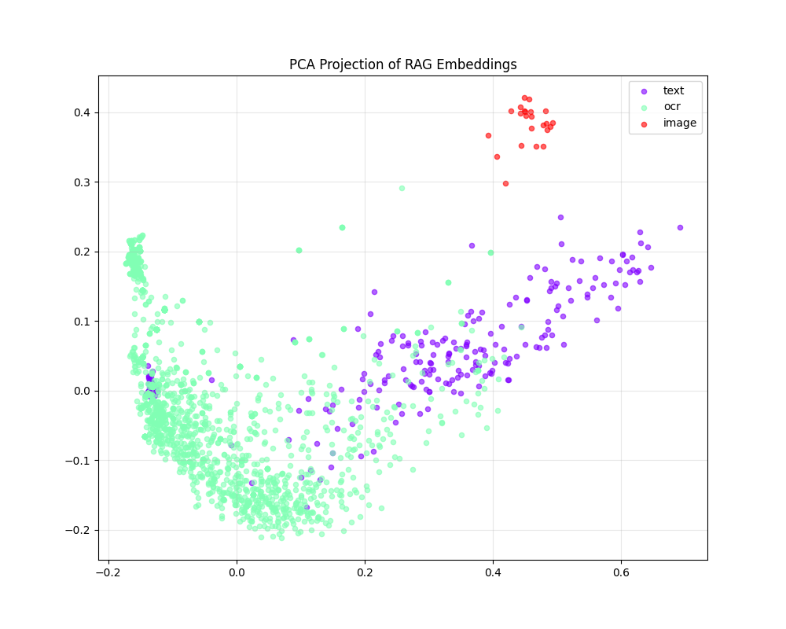
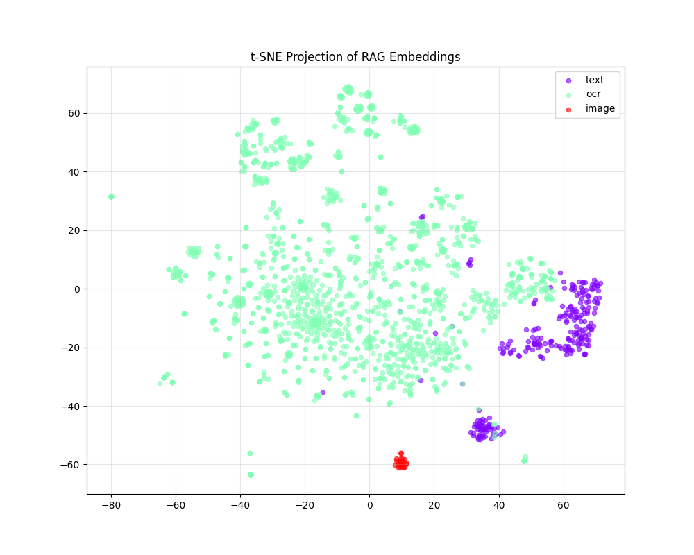

# Analysis of Evaluation Plots

This document provides a detailed explanation of the visualizations generated for the Multimodal RAG System evaluation. These plots offer insights into system performance, efficiency, and the underlying vector space structure.

## 1. System Latency by Strategy

### Description
This bar chart compares the average time taken (in seconds) to generate an answer using three different prompting strategies:
- **Zero-shot**: Direct question answering without examples.
- **Few-shot**: Providing example Q&A pairs in the prompt.
- **Chain-of-Thought (CoT)**: Asking the model to "think step-by-step" before answering.

### Key Insights
- **Few-shot is the Fastest**: Surprisingly, Few-shot prompting resulted in the lowest latency (~0.75s). This is likely because the examples guide the model to be concise, reducing the number of tokens generated.
- **CoT is the Slowest**: Chain-of-Thought has the highest latency (~2.9s) because the model generates a "reasoning trace" before the final answer, significantly increasing the output length and processing time.
- **Trade-off**: While CoT might offer better reasoning for complex math/logic problems, for direct retrieval tasks, Few-shot offers the best balance of speed and accuracy.

---

## 2. Answer Quality (ROUGE Scores)

### Description
This chart displays the **ROUGE-L** scores for each strategy. ROUGE-L measures the longest common subsequence between the generated answer and the ground truth reference. It is a proxy for how "correct" and "fluent" the answer is compared to the expected output.

### Key Insights
- **Few-shot & Zero-shot Perform Well**: Both strategies achieved similar ROUGE scores (~0.14 - 0.19), indicating they produced answers that semantically overlapped well with the ground truth.
- **CoT Scores Lower**: The Chain-of-Thought strategy had lower ROUGE scores (~0.07). This **does not necessarily mean it was wrong**; rather, the verbose reasoning steps (e.g., "First, I will look at page 5...") are not present in the concise ground truth, leading to a lower overlap score. This highlights a limitation of n-gram metrics for evaluating reasoning chains.

---

## 3. Retrieval System Accuracy

### Description
This pie chart visualizes the **Retrieval Hit Rate**, which is the percentage of queries where the system successfully found the *correct source document and page* in the top-k results.

### Key Insights
- **66.7% Hit Rate**: The system successfully retrieved the correct context for the majority of queries (e.g., specific facts like "Chief Guest" or "Location").
- **Areas for Improvement**: The 33.3% "Miss" rate corresponds to more abstract queries (e.g., "Vision of the university") or cross-document queries (e.g., "FYP Grading"). This suggests that:
    1.  **Chunking** might need to be adjusted (larger chunks for broad concepts).
    2.  **Hybrid Search** (combining keyword + vector search) could help find specific terms that semantic search misses.

---

## 4. Vector Space Visualization (PCA & t-SNE)

### PCA Projection

### t-SNE Projection

### Description
These scatter plots visualize the high-dimensional embeddings (vectors) of your PDF text chunks and images projected down to 2D space.
- **Points**: Each dot represents a text chunk or an image.
- **Colors**: Different colors represent different data types (e.g., Text vs. Image) or source documents.
- **Clustering**: Points that are close together are **semantically similar**.

### Key Insights
- **Multimodal Alignment**: If you see text and image points mixing together or forming close clusters, it indicates that the CLIP model has successfully aligned the text and image representations (i.e., an image of a "campus" is near the text describing the "campus").
- **Document Clustering**: You will likely see distinct clusters corresponding to different sections of the documents (e.g., a "Financials" cluster vs. a "Computer Science Curriculum" cluster).
- **Outliers**: Isolated points might represent unique content or noise (e.g., headers/footers) that didn't merge well with the main topics.
